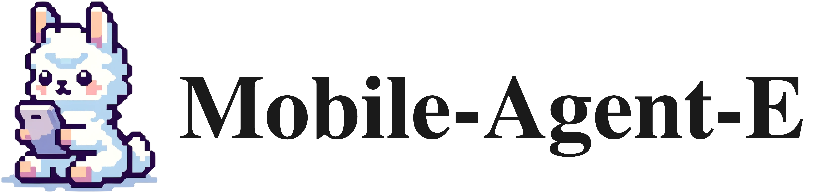

<p align="center">
  
</p>

# Mobile-Agent-E: Self-Evolving Mobile Assistant for Complex Tasks
<!-- <div align="center">
    <a href="https://huggingface.co/spaces/junyangwang0410/Mobile-Agent"></a>
    <a href="https://modelscope.cn/studios/wangjunyang/Mobile-Agent-v2"></a>
  <a href="https://arxiv.org/abs/2406.01014 "></a>
  <a href="https://huggingface.co/papers/2406.01014"></a>
</div>
<br> -->
<p align="center">
<a href="https://x-plug.github.io/MobileAgent">🌐 Homepage</a>
•
<a href="">📃 Paper (coming soon)</a>
•
<a href="https://github.com/X-PLUG/MobileAgent/tree/main/Mobile-Agent-E" >💻 Code</a>
•
<a href="https://huggingface.co/datasets/mikewang/mobile_eval_e" >🤗 Data</a>


<div align="center">
Zhenhailong Wang<sup>1†</sup>, Haiyang Xu<sup>2†</sup>, Junyang Wang<sup>2</sup>, Xi Zhang<sup>2</sup>,
Ming Yan<sup>2</sup>, Ji Zhang<sup>2</sup>, Fei Huang<sup>2</sup>, Heng Ji<sup>1†</sup>
</div>
<br>
<div align="center">
{wangz3, hengji}@illinois.edu, shuofeng.xhy@alibaba-inc.com
</div>
<br>
<div align="center">
<sup>1</sup>University of Illinois Urbana-Champaign   <sup>2</sup>Alibaba Group
</div>
<div align="center">
<sup>†</sup>Corresponding author
</div>
<br>

<p align="center">
  
</p>

## 💻 Environment Setup
❗We tested exclusively on **Android OS**. Mobile-Agent-E does not support **iOS** at this time.

❗All experiments are done on a Samsung Galaxy A15 device, performance may vary on a different device. We encourage the users to custom the inital tips for your device and tasks.

### Installation
```
conda env create -f environment.yml
conda activate mobile_agent_e
```

### Preparation for Connecting Mobile Device with ADB

1. Download the [Android Debug Bridge](https://developer.android.com/tools/releases/platform-tools?hl=en).
2. Turn on the ADB debugging switch on your Android phone, it needs to be turned on in the developer options first.
3. Connect your phone to the computer with a data cable and select "Transfer files".
4. Test your ADB environment as follow: ```/path/to/adb devices```. If the connected devices are displayed, the preparation is complete.
5. If you are using a MAC or Linux system, make sure to turn on adb permissions as follow: ```sudo chmod +x /path/to/adb```
6. If you are using Windows system, the path will be ```xx/xx/adb.exe```

### Install the ADB Keyboard on your Mobile Device
1. Download the ADB keyboard [apk](https://github.com/senzhk/adbkeyboard/blob/master/adbkeyboard.apk) installation package.
2. Click the apk to install on your mobile device.
3. Switch the default input method in the system settings to "ADB Keyboard".

### Agent Configs
Please refer to the `# Edit your Setting #` section in `inference_agent_E.py` for all configs for customizing your agent. You can directly modify the macros or control some of them by setting the environment varibles as follows:

1. ADB Path
    ```
    export ADB_PATH="your/path/to/adb"
    ```
2. Backbone model and API keys: you can choose from OpenAI, Gemini, and Claude; Set the corresponding keys as follows:
    ```
    export BACKBONE_TYPE="OpenAI"
    export OPENAI_API_KEY="your-openai-key"
    ```
    ```
    export BACKBONE_TYPE="Gemini"
    export GEMINI_API_KEY="your-gemini-key"
    ```
    ```
    export BACKBONE_TYPE="Claude"
    export CLAUDE_API_KEY="your-claude-key"
    ```
3. Perceptor: By default, the icon captioning model (`CAPTION_MODEL`) in Perceptor uses "qwen-vl-plus" from Qwen API:
    - Follow this to get an [Qwen API Key](https://help.aliyun.com/document_detail/2712195.html?spm=a2c4g.2712569.0.0.5d9e730aymB3jH) 
    - Set the Qwen API key:
        ```
        export QWEN_API_KEY="your-qwen-api-key"
        ```
    - You can set the `CAPTION_MODEL` in `inference_agent_E.py` to "qwen-vl-max" for a better perception performance but with higher pricing.
    - If you machine is equipped with a high-performance GPU, you can also choose to host the icon captioning model locally: (1) set the `CAPTION_CALL_METHOD` to "local"; (2) set `CAPTION_MODEL` to 'qwen-vl-chat' or 'qwen-vl-chat-int4' depending on the GPU spec.

4. Customize initial Tips: You can tailor the tips for the agent to suit your specific device and needs. To do so, modify the `INIT_TIPS` in `inference_agent_E.py`

## 🚀 Quick Start

The agent can be run in both `individual` (performing a standalone task) or `evolution` (performing a sequence of tasks with evolution) settings. We provide example shell scripts as follows:

- Run on a standalone task:
    ```
    bash scripts/run_task.sh
    ```

- Run on a sequence of tasks with self-evolution. This script loads in an toy example json file from `data/custom_tasks_example.json`.
    ```
    bash scripts/run_tasks_evolution.sh
    ```

## 🤗 Mobile-Eval-E Benchmark
The proposed Mobile-Eval-E benchmark can be found in `data/Mobile-Eval-E` and also on [Huggingface Datasets](https://huggingface.co/datasets/mikewang/mobile_eval_e).


## 📚 Citation

```bibtex
```