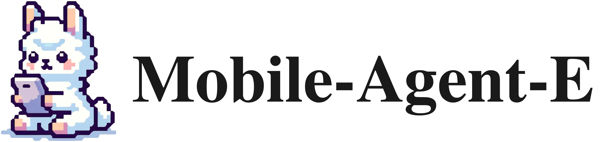

<p align="center">
  
</p>

<div align="center">
  <h1>Mobile-Agent-E: 可自主进化的移动助手，可执行复杂任务</h1>
</div>

<!-- # Mobile-Agent-E: Self-Evolving Mobile Assistant for Complex Tasks -->
<!-- <div align="center">
    <a href="https://huggingface.co/spaces/junyangwang0410/Mobile-Agent"></a>
    <a href="https://modelscope.cn/studios/wangjunyang/Mobile-Agent-v2"></a>
  <a href="https://arxiv.org/abs/2406.01014 "></a>
  <a href="https://huggingface.co/papers/2406.01014"></a>
</div>
<br> -->
<p align="center">
<a href="https://x-plug.github.io/MobileAgent">🌐 主页</a>
•
<a href="https://arxiv.org/abs/2501.11733">🗃️ arXiv</a>
•
<a href="https://x-plug.github.io/MobileAgent/Mobile-Agent-E/static/pdf/mobile_agent_e_jan20_arxiv.pdf">📃 PDF </a>
•
<a href="https://github.com/X-PLUG/MobileAgent/tree/main/Mobile-Agent-E" >💻 代码</a>
•
<a href="https://huggingface.co/datasets/mikewang/mobile_eval_e" >🤗 数据</a>


<div align="center">
Zhenhailong Wang<sup>1†</sup>, Haiyang Xu<sup>2†</sup>, Junyang Wang<sup>2</sup>, Xi Zhang<sup>2</sup>,
Ming Yan<sup>2</sup>, Ji Zhang<sup>2</sup>, Fei Huang<sup>2</sup>, Heng Ji<sup>1†</sup>
</div>
<br>
<div align="center">
{wangz3, hengji}@illinois.edu, shuofeng.xhy@alibaba-inc.com
</div>
<br>
<div align="center">
<sup>1</sup>University of Illinois Urbana-Champaign   <sup>2</sup>Alibaba Group
</div>
<div align="center">
<sup>†</sup>Corresponding author
</div>
<br>

</div>
<div align="center">
  <a href="README_zh.md">简体中文</a> | <a href="README.md">English</a>
<hr>
</div>

<p align="center">
  
</p>

## 💻 Environment Setup
❗我们仅在**Android**操作系统上进行了测试。Mobile-Agent-E 目前不支持**iOS**。

❗所有实验均在三星 Galaxy A15 设备上进行，不同设备上的性能可能会有所不同。我们鼓励用户根据自己的设备和任务自定义初始提示。

### 安装
```
conda create -n mobile_agent_e python=3.10 -y
conda activate mobile_agent_e
pip install -r requirements.txt
```

### 准备通过ADB连接你的移动设备

1. 下载 [Android Debug Bridge](https://developer.android.com/tools/releases/platform-tools?hl=en)（ADB）。
2. 在你的移动设备上开启“USB调试”或“ADB调试”，它通常需要打开开发者选项并在其中开启。如果是HyperOS系统需要同时打开 "[USB调试(安全设置)](https://github.com/user-attachments/assets/05658b3b-4e00-43f0-87be-400f0ef47736)"。
3. 通过数据线连接移动设备和电脑，在手机的连接选项中选择“传输文件”。
4. 用下面的命令来测试你的连接是否成功: ```/path/to/adb devices```。如果输出的结果显示你的设备列表不为空，则说明连接成功。
5. 如果你是用的是MacOS或者Linux，请先为 ADB 开启权限: ```sudo chmod +x /path/to/adb```。
6.  ```/path/to/adb```在Windows电脑上将是```xx/xx/adb.exe```的文件格式，而在MacOS或者Linux则是```xx/xx/adb```的文件格式。

### 在你的移动设备上安装 ADB 键盘
1. 下载 ADB 键盘的 [apk](https://github.com/senzhk/ADBKeyBoard/blob/master/ADBKeyboard.apk)  安装包。
2. 在设备上点击该 apk 来安装。
3. 在系统设置中将默认输入法切换为 “ADB Keyboard”。

### Agent Configs
请参阅 `inference_agent_E.py` 中的 `# Edit your Setting #` 部分，了解自定义代理的所有配置。您可以直接修改宏，也可以通过设置环境变量来控制其中一些配置，如下所示：

1. ADB 路径
    ```
    export ADB_PATH="your/path/to/adb"
    ```
2. 基模型和 API keys: 您可以从 OpenAI、Gemini、Claude 或 MiniMax 中选择，设置相应的键如下:
    ```
    export BACKBONE_TYPE="OpenAI"
    export OPENAI_API_KEY="your-openai-key"
    ```
    ```
    export BACKBONE_TYPE="Gemini"
    export GEMINI_API_KEY="your-gemini-key"
    ```
    ```
    export BACKBONE_TYPE="Claude"
    export CLAUDE_API_KEY="your-claude-key"
    ```
    ```
    export BACKBONE_TYPE="MiniMax"
    export MINIMAX_API_KEY="your-minimax-key"
    # 可选：覆盖 OpenAI-compatible endpoint
    export MINIMAX_API_URL="https://api.minimax.io/v1/chat/completions"
    ```
3. 感知器: 默认情况下，Perceptor 中的图标字幕模型 (`CAPTION_MODEL`) 使用 Qwen API 中的“qwen-vl-plus”：
    - 按照此步骤获取 [Qwen API Key](https://help.aliyun.com/document_detail/2712195.html?spm=a2c4g.2712569.0.0.5d9e730aymB3jH)
    - 设置 Qwen API Key：
        ```
        export QWEN_API_KEY="your-qwen-api-key"
        ```
    - 您可以将 `inference_agent_E.py` 中的 `CAPTION_MODEL` 设置为“qwen-vl-max”，以获得更好的感知性能，但价格更高。
    - 如果您的机器配备了高性能 GPU，您也可以选择在本地托管图标字幕模型：
    (1) 将 `CAPTION_CALL_METHOD` 设置为“local”； （2）根据 GPU 规格将 `CAPTION_MODEL` 设置为 'qwen-vl-chat' 或 'qwen-vl-chat-int4'。

4. 自定义初始提示：您可以根据特定设备和需求定制代理的提示。为此，请修改“inference_agent_E.py”中的“INIT_TIPS”。“data/custom_tips_example_for_cn_apps.txt”中提供了针对小红书和淘宝等中国应用的自定义提示示例。

## 🚀 快速开始

代理可以在“individual”（执行独立任务）或“evolution”（使用 Evolution 执行一系列任务）设置下运行。我们提供以下示例 Shell 脚本：

- 在独立任务上运行:
    ```
    bash scripts/run_task.sh
    ```

- 运行一系列具有自我进化的任务。此脚本加载了一个示例 JSON 文件，该文件来自 `data/custom_tasks_example.json`.
    ```
    bash scripts/run_tasks_evolution.sh
    ```

## 🤗 Mobile-Eval-E 基准测试
建议的 Mobile-Eval-E 基准测试可在 `data/Mobile-Eval-E` 和 [Huggingface 数据集](https://huggingface.co/datasets/mikewang/mobile_eval_e) 中找到。


## 📚 引用

```bibtex
@article{wang2025mobile,
  title={Mobile-Agent-E: Self-Evolving Mobile Assistant for Complex Tasks},
  author={Wang, Zhenhailong and Xu, Haiyang and Wang, Junyang and Zhang, Xi and Yan, Ming and Zhang, Ji and Huang, Fei and Ji, Heng},
  journal={arXiv preprint arXiv:2501.11733},
  year={2025}
}
```