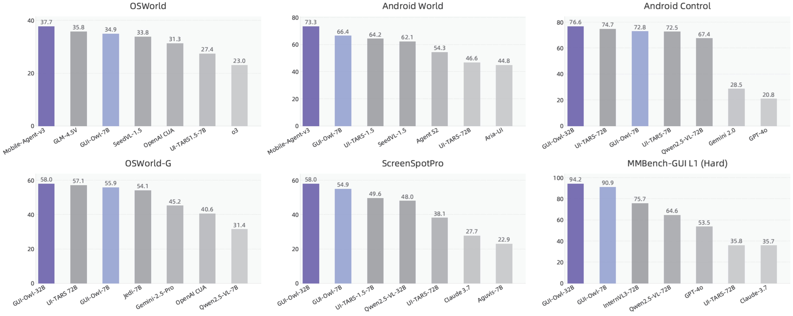

<div align="center">
<p align="center">
  
</p>
</div>

<div align="center">
<h2 style="font-size: 28px;">
	
 	Mobile-Agent: The Powerful GUI Agent Family by Tongyi Lab, Alibaba Group
</h2>

<div align="center">
<p align="center">
  
</p>
</div>

<p align="center">
<a href="https://trendshift.io/repositories/7423" target="_blank"></a>
</p>

<p align="center">
	🤗 <a href="https://huggingface.co/mPLUG/GUI-Owl-32B" target="_blank">GUI-Owl-32B</a> | 
	 <a href="https://modelscope.cn/models/iic/GUI-Owl-32B" target="_blank">GUI-Owl-32B</a> ｜
	🤗 <a href="https://huggingface.co/mPLUG/GUI-Owl-7B" target="_blank">GUI-Owl-7B</a> |
	 <a href="https://modelscope.cn/models/iic/GUI-Owl-7B" target="_blank">GUI-Owl-7B</a>
</p>

<!-- 
<div align="center">
	<a href="https://www.modelscope.cn/studios/wangjunyang/PC-Agent"></a>
  <a href="https://arxiv.org/abs/?"></a>
</div> -->

</div>
<div align="center">
  <a href="README.md">English</a> | <a href="README_zh.md">简体中文</a>
<hr>
</div>


## 📢News
- `[2025.9.16]`🔥 We've open-sourced the code of GUI-Owl and Mobile-Agent-v3 on OSWorld benchmark. See the [Code](https://github.com/X-PLUG/MobileAgent/tree/main/Mobile-Agent-v3#evaluation-on-osworld).
- `[2025.9.10]`🔥 We've open-sourced the code of AndroidWorld benchmark and real-world mobile scenarios for GUI-Owl and Mobile-Agent-v3. See the [AndroidWorld Code](https://github.com/X-PLUG/MobileAgent/tree/main/Mobile-Agent-v3#evaluation-on-androidworld) and [Real-world Scenarios Code](https://github.com/X-PLUG/MobileAgent/tree/main/Mobile-Agent-v3#deploy-mobile-agent-v3-on-your-mobile-device).
- `[2025.8.20]`All new **GUI-Owl** and **Mobile-Agent-v3** are released! Technical report can be found [here](https://arxiv.org/abs/2508.15144). And model checkpoint will be released on [GUI-Owl-7B](https://huggingface.co/mPLUG/GUI-Owl-7B) and [GUI-Owl-32B](https://huggingface.co/mPLUG/GUI-Owl-32B).
  - GUI-Owl is a multi-modal cross-platform GUI VLM with GUI perception, grounding, and end-to-end operation capabilities.
  - Mobile-Agent-v3 is a cross-platform multi-agent framework based on GUI-Owl. It provides capabilities such as planning, progress management, reflection, and memory.
- `[2025.8.14]`Mobile-Agent-v3 won the **best demo award** at the ***The 24rd China National Conference on Computational Linguistics*** (CCL 2025).
- `[2025.3.17]` PC-Agent has been accepted by the **ICLR 2025 Workshop**.
- `[2024.9.26]` Mobile-Agent-v2 has been accepted by **The Thirty-eighth Annual Conference on Neural Information Processing Systems (NeurIPS 2024)**.
- `[2024.7.29]` Mobile-Agent won the **best demo award** at the ***The 23rd China National Conference on Computational Linguistics*** (CCL 2024).
- `[2024.3.10]` Mobile-Agent has been accepted by the **ICLR 2024 Workshop**.


## 📊Results

<div align="center">
<p align="center">
  
</p>
</div>

## 👀Features

<div align="center">
<p align="center">
  
</p>
</div>

### GUI-Owl
- SOTA results within 7B.
- A native end-to-end multimodal agent designed as a foundational model for GUI automation.
- Unifying perception, grounding, reasoning, planning, and action execution within a single policy network.
- Robust cross-platform interaction and multi-turn decision making with explicit intermediate reasoning.
- GUI-Owl can be instantiated as different specialized agents within Mobile-Agent-v3.

### Mobile-Agent-v3
- Dynamic task decomposition, planning and progress management.
- The highly integrated operating space reduces the perception and operation frequency of the model.
- Extensive exception handling and reflection capabilities provide more stable performance in scenarios such as pop-ups and advertisements.
- The key information recording capability enables cross-application tasks.

## 📝Series of Work

- [**Mobile-Agent-v3**](https://github.com/X-PLUG/MobileAgent/tree/main/Mobile-Agent-v3) (Preprint): Multi-modal and multi-platform GUI agent. [**[Paper]**](https://arxiv.org/abs/2508.15144) [**[Code]**](https://github.com/X-PLUG/MobileAgent/tree/main/Mobile-Agent-v3)
- [**GUI-Critic-R1**](https://github.com/X-PLUG/MobileAgent/tree/main/GUI-Critic-R1) (Preprint): A GUI-Critic for pre-operative error diagnosis method. [**[Paper]**](https://arxiv.org/abs/2506.04614) [**[Code]**](https://github.com/X-PLUG/MobileAgent/tree/main/GUI-Critic-R1)
- [**PC-Agent**](https://github.com/X-PLUG/MobileAgent/tree/main/PC-Agent) (ICLR 2025 Workshop): Multi-agent for multimodal PC operation. [**[Paper]**](https://arxiv.org/abs/2502.14282) [**[Code]**](https://github.com/X-PLUG/MobileAgent/tree/main/PC-Agent)
- [**Mobile-Agent-E**](https://github.com/X-PLUG/MobileAgent/tree/main/Mobile-Agent-E) (Preprint): Multi-agent for self-evolving mobile phone operation. [**[Paper]**](https://arxiv.org/abs/2501.11733) [**[Code]**](https://github.com/X-PLUG/MobileAgent/tree/main/Mobile-Agent-E)
- [**Mobile-Agent-v2**](https://github.com/X-PLUG/MobileAgent/tree/main/Mobile-Agent-v2) (NeurIPS 2024): Multi-agent for multimodal mobile phone operation. [**[Paper]**](https://arxiv.org/abs/2406.01014) [**[Code]**](https://github.com/X-PLUG/MobileAgent/tree/main/Mobile-Agent-v2)
- [**Mobile-Agent-v1**](https://github.com/X-PLUG/MobileAgent/tree/main/Mobile-Agent-v1) (ICLR 2024 Workshop): Single-agent for multimodal mobile phone operation. [**[Paper]**](https://arxiv.org/abs/2401.16158) [**[Code]**](https://github.com/X-PLUG/MobileAgent/tree/main/Mobile-Agent-v1)

## 📺Demo

<div align="left">
    <h3>Learn about Mobile-Agent-v3.</h3>
    <video src= "https://github.com/user-attachments/assets/ec7defa1-e6c5-40d2-84bd-c54e26a3fcec"/>
</div>

### 💻PC

<div align="left">
    <h3>Create a new blank PPT, and then insert a piece of text in the form of Word Art into the first slide, with the content being "Alibaba".</h3>
    <video src= "https://github.com/user-attachments/assets/a978087a-717b-4c8a-9e50-9223dac019dd"/>
</div>

### 🌐Web

<div align="left">
    <h3>Please help me search for flights from Beijing to Paris on Skyscanner departing on September 18th and returning on September 21st.</h3>
    <video src= "https://github.com/user-attachments/assets/fd49a192-f876-4862-b0c3-30aaaf48643a"/>
</div>

### 📱Phone

<div align="left">
    <h3>Please help me search for Jinan travel guides on Xiaohongshu, sort them by the number of collections, and save the first note.</h3>
    <video src= "https://github.com/user-attachments/assets/3a405952-953a-4c2a-a26c-d738b6622564"/>
</div>

## ⭐Star History
[](https://star-history.com/#X-PLUG/MobileAgent&Date)

## 📑Citation
If you find Mobile-Agent useful for your research and applications, please cite using this BibTeX:
```
@article{ye2025mobile,
  title={Mobile-Agent-v3: Foundamental Agents for GUI Automation},
  author={Ye, Jiabo and Zhang, Xi and Xu, Haiyang and Liu, Haowei and Wang, Junyang and Zhu, Zhaoqing and Zheng, Ziwei and Gao, Feiyu and Cao, Junjie and Lu, Zhengxi and others},
  journal={arXiv preprint arXiv:2508.15144},
  year={2025}
}

@article{wanyan2025look,
  title={Look Before You Leap: A GUI-Critic-R1 Model for Pre-Operative Error Diagnosis in GUI Automation},
  author={Wanyan, Yuyang and Zhang, Xi and Xu, Haiyang and Liu, Haowei and Wang, Junyang and Ye, Jiabo and Kou, Yutong and Yan, Ming and Huang, Fei and Yang, Xiaoshan and others},
  journal={arXiv preprint arXiv:2506.04614},
  year={2025}
}

@article{liu2025pc,
  title={PC-Agent: A Hierarchical Multi-Agent Collaboration Framework for Complex Task Automation on PC},
  author={Liu, Haowei and Zhang, Xi and Xu, Haiyang and Wanyan, Yuyang and Wang, Junyang and Yan, Ming and Zhang, Ji and Yuan, Chunfeng and Xu, Changsheng and Hu, Weiming and Huang, Fei},
  journal={arXiv preprint arXiv:2502.14282},
  year={2025}
}

@article{wang2025mobile,
  title={Mobile-Agent-E: Self-Evolving Mobile Assistant for Complex Tasks},
  author={Wang, Zhenhailong and Xu, Haiyang and Wang, Junyang and Zhang, Xi and Yan, Ming and Zhang, Ji and Huang, Fei and Ji, Heng},
  journal={arXiv preprint arXiv:2501.11733},
  year={2025}
}

@article{wang2024mobile2,
  title={Mobile-Agent-v2: Mobile Device Operation Assistant with Effective Navigation via Multi-Agent Collaboration},
  author={Wang, Junyang and Xu, Haiyang and Jia, Haitao and Zhang, Xi and Yan, Ming and Shen, Weizhou and Zhang, Ji and Huang, Fei and Sang, Jitao},
  journal={arXiv preprint arXiv:2406.01014},
  year={2024}
}

@article{wang2024mobile,
  title={Mobile-Agent: Autonomous Multi-Modal Mobile Device Agent with Visual Perception},
  author={Wang, Junyang and Xu, Haiyang and Ye, Jiabo and Yan, Ming and Shen, Weizhou and Zhang, Ji and Huang, Fei and Sang, Jitao},
  journal={arXiv preprint arXiv:2401.16158},
  year={2024}
}
```
