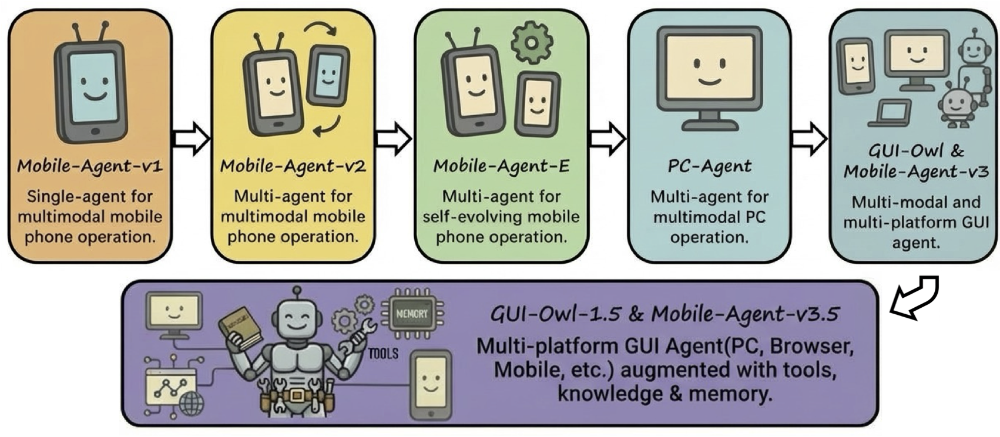

<div align="center">
<p align="center">
  
</p>
</div>

<div align="center">
<h2 style="font-size: 28px;">
	
 	Mobile-Agent: The Powerful GUI Agent Family by Tongyi Lab, Alibaba Group
</h2>

<div align="center">
<p align="center">
  
</p>
</div>

<p align="center">
<a href="https://trendshift.io/repositories/7423" target="_blank"></a>
</p>

👏 Welcome to try Mobile-Agent-v3.5 via our **[ Modelscope online demo](http://modelscope.cn/studios/MobileAgentTest/computer_use)** or **[ Bailian online demo](https://bailian.console.aliyun.com/next?tab=demohouse#/experience/adk-computer-use/pc)**!

❗️We provide the limited-time free Mobile-Agent-v3 API on Bailian for quick experience. View the [documentation](https://help.aliyun.com/zh/model-studio/ui-agent-api).

<p align="center">
	🤗 <a href="https://huggingface.co/collections/mPLUG/gui-owl-15" target="_blank">GUI-Owl-1.5 Collection</a>
</p>
<p align="center">
	🤗 <a href="https://huggingface.co/mPLUG/GUI-Owl-32B" target="_blank">GUI-Owl-32B</a> | 
	 <a href="https://modelscope.cn/models/iic/GUI-Owl-32B" target="_blank">GUI-Owl-32B</a> ｜
	🤗 <a href="https://huggingface.co/mPLUG/GUI-Owl-7B" target="_blank">GUI-Owl-7B</a> |
	 <a href="https://modelscope.cn/models/iic/GUI-Owl-7B" target="_blank">GUI-Owl-7B</a>
</p>

</div>
<div align="center">
  <a href="README.md">English</a> | <a href="README_zh.md">简体中文</a>
<hr>
</div>

## 📢News

- `[2026.2.14]`🔥🔥 **GUI-Owl 1.5** is released, a new family of native multi-platform GUI agent foundation models (2B/4B/8B/32B/235B; Instruct & Thinking). The next-generation native GUI agent model family built on Qwen3-VL, supporting **desktop/mobile/browser** automation and achieving **SOTA results on 20+ GUI benchmarks**, with strong performance on end-to-end tasks, grounding, tool/MCP calling, and long-horizon memory. Model weights are available on [HuggingFace](https://huggingface.co/collections/mPLUG/gui-owl-15). Technical report is avaliable on [Link](https://arxiv.org/abs/2602.16855). See the [GUI-Owl 1.5 README](https://github.com/X-PLUG/MobileAgent/tree/main/Mobile-Agent-v3.5) for details.
- `[2025.11.25]`🔥 The GUI-Owl series models are now available for online inference, thanks to [**Alibaba Cloud Bailian**](https://bailian.console.aliyun.com/?spm=5176.21213303.J_qCOwPWspKEuWcmp8qiZNQ.131.39712f3dOmFAxI&scm=20140722.S_card%40%40%E4%BA%A7%E5%93%81%40%402983180.S_card0.ID_card%40%40%E4%BA%A7%E5%93%81%40%402983180-RL_%E7%99%BE%E7%82%BC-LOC_search%7EUND%7Ecard%7EUND%7Eitem-OR_ser-V_3-P0_0&tab=model#/model-market/detail/gui-plus) for providing computing power support. Please refer to the [Link](https://modelscope.cn/models/iic/GUI-Owl-7B).
- `[2025.10.30]` We released **OSWorld-MCP**, which is a benchmark for evaluating Model Context Protocol (MCP) tool invocation capabilities in real-world scenarios. See the [Link](https://github.com/X-PLUG/OSWorld-MCP).
- `[2025.9.24]` We've released the demo on ModelScope that's based on Wuying Cloud Desktop and Phone. No need to deploy models locally or prepare devices, just input your instruction to experience Mobile-Agent-v3! [ ModelScope Demo Link](https://modelscope.cn/studios/wangjunyang/Mobile-Agent-v3) and [ Bailian Demo Link](https://bailian.console.aliyun.com/next?tab=demohouse#/experience/adk-computer-use/pc). For a limited-time free Mobile-Agent-v3 API, please check the [documentation](https://help.aliyun.com/zh/model-studio/ui-agent-api). The new version based on Qwen-3-VL is coming soon.
- `[2025.9.19]` GUI-Critic-R1 has been accepted by **The Thirty-ninth Annual Conference on Neural Information Processing Systems (NeurIPS 2025)**. 
- `[2025.9.16]` We have released our latest work, **UI-S1: Advancing GUI Automation via Semi-online Reinforcement Learning**. The [paper](https://www.arxiv.org/abs/2509.11543), [code](https://github.com/X-PLUG/MobileAgent/tree/main/UI-S1), [dataset](https://huggingface.co/datasets/mPLUG/UI_S1_dataset) and [model](https://huggingface.co/mPLUG/UI-S1-7B) are now open-sourced.
- `[2025.9.16]` We've open-sourced the code of GUI-Owl and Mobile-Agent-v3 on OSWorld, AndroidWorld, and real-world mobile scenarios. See the [OSWorld Code](https://github.com/X-PLUG/MobileAgent/tree/main/Mobile-Agent-v3#evaluation-on-osworld). The OSWorld RL-tuned [checkpoint](https://huggingface.co/mPLUG/GUI-Owl-7B-Desktop-RL) of GUI-Owl is also released. See the [AndroidWorld Code](https://github.com/X-PLUG/MobileAgent/tree/main/Mobile-Agent-v3#evaluation-on-androidworld) and [Real-world Scenarios Code](https://github.com/X-PLUG/MobileAgent/tree/main/Mobile-Agent-v3#deploy-mobile-agent-v3-on-your-mobile-device).
- `[2025.8.20]`All new **GUI-Owl** and **Mobile-Agent-v3** are released! Technical report can be found [here](https://arxiv.org/abs/2508.15144). And model checkpoint will be released on [GUI-Owl-7B](https://huggingface.co/mPLUG/GUI-Owl-7B) and [GUI-Owl-32B](https://huggingface.co/mPLUG/GUI-Owl-32B).
  - GUI-Owl is a multi-modal cross-platform GUI VLM with GUI perception, grounding, and end-to-end operation capabilities.
  - Mobile-Agent-v3 is a cross-platform multi-agent framework based on GUI-Owl. It provides capabilities such as planning, progress management, reflection, and memory.
- `[2025.8.14]`Mobile-Agent-v3 won the **best demo award** at the ***The 24rd China National Conference on Computational Linguistics*** (CCL 2025).
- `[2025.3.17]` PC-Agent has been accepted by the **ICLR 2025 Workshop**.
- `[2024.9.26]` Mobile-Agent-v2 has been accepted by **The Thirty-eighth Annual Conference on Neural Information Processing Systems (NeurIPS 2024)**.
- `[2024.7.29]` Mobile-Agent won the **best demo award** at the ***The 23rd China National Conference on Computational Linguistics*** (CCL 2024).
- `[2024.3.10]` Mobile-Agent has been accepted by the **ICLR 2024 Workshop**.

## 📊Results

<div align="center">
<p align="center">
  
</p>
</div>

## 👀Features

<div align="center">
<p align="center">
  
</p>
</div>

## 📝Series of Work

- [**Mobile-Agent-v3.5**](https://github.com/X-PLUG/MobileAgent/tree/main/Mobile-Agent-v3.5) (Preprint): Multi-platform Fundamental GUI Agents. [**[Paper]**](https://arxiv.org/abs/2602.16855) [**[Code]**](https://github.com/X-PLUG/MobileAgent/tree/main/Mobile-Agent-v3.5)
- [**Mobile-Agent-v3**](https://github.com/X-PLUG/MobileAgent/tree/main/Mobile-Agent-v3) (Preprint): Multi-modal and multi-platform GUI agent. [**[Paper]**](https://arxiv.org/abs/2508.15144) [**[Code]**](https://github.com/X-PLUG/MobileAgent/tree/main/Mobile-Agent-v3)
- [**UI-S1**](https://github.com/X-PLUG/MobileAgent/tree/main/UI-S1) (Preprint): Advancing GUI Automation via Semi-online Reinforcement Learning. [**[Paper]**](https://arxiv.org/abs/2509.11543) [**[Code]**](https://github.com/X-PLUG/MobileAgent/tree/main/UI-S1) [**[Dataset]**](https://huggingface.co/datasets/mPLUG/UI_S1_dataset)
- [**GUI-Critic-R1**](https://github.com/X-PLUG/MobileAgent/tree/main/GUI-Critic-R1) (NeurIPS 2025): A GUI-Critic for pre-operative error diagnosis method. [**[Paper]**](https://arxiv.org/abs/2506.04614) [**[Code]**](https://github.com/X-PLUG/MobileAgent/tree/main/GUI-Critic-R1)
- [**PC-Agent**](https://github.com/X-PLUG/MobileAgent/tree/main/PC-Agent) (ICLR 2025 Workshop): Multi-agent for multimodal PC operation. [**[Paper]**](https://arxiv.org/abs/2502.14282) [**[Code]**](https://github.com/X-PLUG/MobileAgent/tree/main/PC-Agent)
- [**Mobile-Agent-E**](https://github.com/X-PLUG/MobileAgent/tree/main/Mobile-Agent-E) (Preprint): Multi-agent for self-evolving mobile phone operation. [**[Paper]**](https://arxiv.org/abs/2501.11733) [**[Code]**](https://github.com/X-PLUG/MobileAgent/tree/main/Mobile-Agent-E)
- [**Mobile-Agent-v2**](https://github.com/X-PLUG/MobileAgent/tree/main/Mobile-Agent-v2) (NeurIPS 2024): Multi-agent for multimodal mobile phone operation. [**[Paper]**](https://arxiv.org/abs/2406.01014) [**[Code]**](https://github.com/X-PLUG/MobileAgent/tree/main/Mobile-Agent-v2)
- [**Mobile-Agent-v1**](https://github.com/X-PLUG/MobileAgent/tree/main/Mobile-Agent-v1) (ICLR 2024 Workshop): Single-agent for multimodal mobile phone operation. [**[Paper]**](https://arxiv.org/abs/2401.16158) [**[Code]**](https://github.com/X-PLUG/MobileAgent/tree/main/Mobile-Agent-v1)

## 📺Demo

<div align="left">
    <h3>Learn about Mobile-Agent-v3.5</h3>
    <video src= "https://github.com/user-attachments/assets/97871c8c-5d1d-4f0f-aab0-84adddacbd0f"/>
</div>

### 💻PC + 🌐Web

<div align="left">
    <h3>Search for the stock prices of Apple and Nvidia respectively. Then create a new spreadsheet in WPS Office. Enter the company names in column A and the retrieved stock prices in column B.</h3>
    <video src= "https://github.com/user-attachments/assets/5dbc349b-0c99-4e66-a5c6-ad6d8accb933"/>
</div>

<div align="left">
    <h3>Create a new document in WPS Office and write a brief introduction about Alibaba with font size 12. Then search for Alibaba's logo in Edge browser, copy an image, and paste it at the end of the document.</h3>
    <video src= "https://github.com/user-attachments/assets/8122baec-b5a1-49d8-a47d-cb613d21ec72"/>
</div>

### 📱Phone

<div align="left">
    <h3>Today is Sunday, February 15, 2025. Search for flights from Guangzhou to Chengdu five days from now on Ctrip, check the cheapest flight, then search for the cheapest train ticker on the same route and tell me their prices.</h3>
    <video src= "https://github.com/user-attachments/assets/4c5f29b1-c319-41bb-876d-9915bc3e215f"/>
</div>

<div align="left">
    <h3>Check the "魔搭ModelScope社区" (ModelScope Community) account on Xiaohongshu and Douyin, then tell me the total follower count across both platforms.</h3>
    <video src= "https://github.com/user-attachments/assets/4ff3e951-f93a-49e8-b800-f060f765d67d"/>
</div>

## ⭐Star History

[](https://star-history.com/#X-PLUG/MobileAgent&Date)

## 📑Citation

If you find Mobile-Agent useful for your research and applications, please cite using this BibTeX:
```
@article{xu2026mobile,
  title={Mobile-Agent-v3. 5: Multi-platform Fundamental GUI Agents},
  author={Xu, Haiyang and Zhang, Xi and Liu, Haowei and Wang, Junyang and Zhu, Zhaozai and Zhou, Shengjie and Hu, Xuhao and Gao, Feiyu and Cao, Junjie and Wang, Zihua and others},
  journal={arXiv preprint arXiv:2602.16855},
  year={2026}
}

@article{ye2025mobile,
  title={Mobile-Agent-v3: Foundamental Agents for GUI Automation},
  author={Ye, Jiabo and Zhang, Xi and Xu, Haiyang and Liu, Haowei and Wang, Junyang and Zhu, Zhaoqing and Zheng, Ziwei and Gao, Feiyu and Cao, Junjie and Lu, Zhengxi and others},
  journal={arXiv preprint arXiv:2508.15144},
  year={2025}
}

@article{lu2025ui,
  title={UI-S1: Advancing GUI Automation via Semi-online Reinforcement Learning},
  author={Lu, Zhengxi and Ye, Jiabo and Tang, Fei and Shen, Yongliang and Xu, Haiyang and Zheng, Ziwei and Lu, Weiming and Yan, Ming and Huang, Fei and Xiao, Jun and others},
  journal={arXiv preprint arXiv:2509.11543},
  year={2025}
}

@article{wanyan2025look,
  title={Look Before You Leap: A GUI-Critic-R1 Model for Pre-Operative Error Diagnosis in GUI Automation},
  author={Wanyan, Yuyang and Zhang, Xi and Xu, Haiyang and Liu, Haowei and Wang, Junyang and Ye, Jiabo and Kou, Yutong and Yan, Ming and Huang, Fei and Yang, Xiaoshan and others},
  journal={arXiv preprint arXiv:2506.04614},
  year={2025}
}

@article{liu2025pc,
  title={PC-Agent: A Hierarchical Multi-Agent Collaboration Framework for Complex Task Automation on PC},
  author={Liu, Haowei and Zhang, Xi and Xu, Haiyang and Wanyan, Yuyang and Wang, Junyang and Yan, Ming and Zhang, Ji and Yuan, Chunfeng and Xu, Changsheng and Hu, Weiming and Huang, Fei},
  journal={arXiv preprint arXiv:2502.14282},
  year={2025}
}

@article{wang2025mobile,
  title={Mobile-Agent-E: Self-Evolving Mobile Assistant for Complex Tasks},
  author={Wang, Zhenhailong and Xu, Haiyang and Wang, Junyang and Zhang, Xi and Yan, Ming and Zhang, Ji and Huang, Fei and Ji, Heng},
  journal={arXiv preprint arXiv:2501.11733},
  year={2025}
}

@article{wang2024mobile2,
  title={Mobile-Agent-v2: Mobile Device Operation Assistant with Effective Navigation via Multi-Agent Collaboration},
  author={Wang, Junyang and Xu, Haiyang and Jia, Haitao and Zhang, Xi and Yan, Ming and Shen, Weizhou and Zhang, Ji and Huang, Fei and Sang, Jitao},
  journal={arXiv preprint arXiv:2406.01014},
  year={2024}
}

@article{wang2024mobile,
  title={Mobile-Agent: Autonomous Multi-Modal Mobile Device Agent with Visual Perception},
  author={Wang, Junyang and Xu, Haiyang and Ye, Jiabo and Yan, Ming and Shen, Weizhou and Zhang, Ji and Huang, Fei and Sang, Jitao},
  journal={arXiv preprint arXiv:2401.16158},
  year={2024}
}
```
