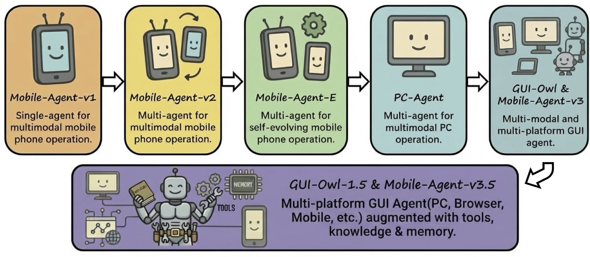
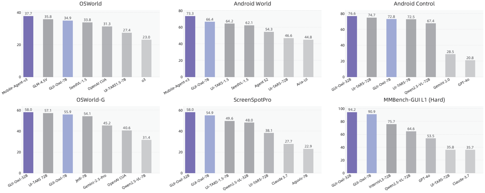

<div align="center">
<p align="center">
  
</p>
</div>

<div align="center">
<h2 style="font-size: 28px;">
	
 	Mobile-Agent: 强大的GUI智能体家族 by 通义实验室-阿里巴巴集团
</h2>

<div align="center">
<p align="center">
  
</p>
</div>

<p align="center">
<a href="https://trendshift.io/repositories/7423" target="_blank"></a>
</p>

👏 欢迎通过我们的 **[ Modelscope在线Demo](http://modelscope.cn/studios/MobileAgentTest/computer_use)** 或 **[ 百炼在线Demo](https://bailian.console.aliyun.com/next?tab=demohouse#/experience/adk-computer-use/pc)** 试用 Mobile-Agent-v3.5！

❗️我们在百炼上提供 Mobile-Agent-v3.5 API，方便快速体验。请查看[文档](https://bailian.console.aliyun.com/cn-beijing?tab=model#/model-market/detail/gui-plus-2026-02-26)。

<p align="center">
	🤗 <a href="https://huggingface.co/collections/mPLUG/gui-owl-15" target="_blank">GUI-Owl-1.5 Collection</a>|
	 <a href="https://modelscope.cn/collections/iic/GUI-Owl-15" target="_blank">GUI-Owl-1.5 Collection</a> 
</p>
<p align="center">
	🤗 <a href="https://huggingface.co/mPLUG/GUI-Owl-32B" target="_blank">GUI-Owl-32B</a> | 
	 <a href="https://modelscope.cn/models/iic/GUI-Owl-32B" target="_blank">GUI-Owl-32B</a> ｜
	🤗 <a href="https://huggingface.co/mPLUG/GUI-Owl-7B" target="_blank">GUI-Owl-7B</a> |
	 <a href="https://modelscope.cn/models/iic/GUI-Owl-7B" target="_blank">GUI-Owl-7B</a>
</p>

</div>
<div align="center">
  <a href="README_zh.md">简体中文</a> | <a href="README.md">English</a>
<hr>
</div>

## 📢新闻
- `[2026.3.31]`🔥🔥 **Mobile-Agent-v3.5**现已在阿里云无影云手机上线——这是一个基于云端的安卓环境，可提供无缝的移动使用体验。了解更多[Alibaba Cloud Wuying Cloud Phone](https://www.aliyun.com/product/cloud-phone) | [Documentation](https://help.aliyun.com/zh/ecp/quickly-experience-and-create-cloud-phone-mobileclaw)
- `[2026.3.19]`🔥🔥 **GUI-Owl-1.5** 系列模型现已上线阿里云百炼平台，可供在线推理。请参考 [ **阿里云百炼**](https://bailian.console.aliyun.com/cn-beijing?tab=model#/model-market/detail/gui-plus-2026-02-26)，[ **魔搭API-Inference**](https://modelscope.cn/models/iic/GUI-Owl-1.5-8B-Think)。
- `[2026.2.14]`🔥 **GUI-Owl-1.5** 正式发布，这是一个全新的原生多平台 GUI 代理基础模型系列（2B/4B/8B/32B/235B；指令与思考）。该新一代原生 GUI 代理模型系列基于 Qwen3-VL 构建，支持**桌面/移动/浏览器**自动化，并在 20 多个 GUI 基准测试中取得了**SOTA 性能**，在端到端任务、接地、工具/MCP 调用和长时域记忆方面均表现出色。模型权重可在 [HuggingFace](https://huggingface.co/collections/mPLUG/gui-owl-15) 获取。技术报告可在 [链接](https://arxiv.org/abs/2602.16855) 获取。详情请参阅 [GUI-Owl 1.5 README](https://github.com/X-PLUG/MobileAgent/tree/main/Mobile-Agent-v3.5)。
- `[2025.11.25]` GUI-Owl系列模型现已支持在线推理，感谢[**阿里云百炼**](https://bailian.console.aliyun.com/?spm=5176.21213303.J_qCOwPWspKEuWcmp8qiZNQ.131.39712f3dOmFAxI&scm=20140722.S_card%40%40%E4%BA%A7%E5%93%81%40%402983180.S_card0.ID_card%40%40%E4%BA%A7%E5%93%81%40%402983180-RL_%E7%99%BE%E7%82%BC-LOC_search%7EUND%7Ecard%7EUND%7Eitem-OR_ser-V_3-P0_0&tab=model#/model-market/detail/gui-plus)提供的算力支持。详情请见[链接](https://modelscope.cn/models/iic/GUI-Owl-7B)。
- `[2025.10.30]` 我们发布了 **OSWorld-MCP**，这是一个用于评估模型上下文协议 (MCP) 工具在实际场景中调用能力的基准测试工具。请参阅[链接](https://github.com/X-PLUG/OSWorld-MCP)。
- `[2025.9.24]` 我们在 ModelScope 上发布了基于无影云电脑和云手机的 demo。无需本地部署模型或准备设备，只需输入指令即可体验 Mobile-Agent-v3！[ ModelScope Demo 链接](https://modelscope.cn/studios/wangjunyang/Mobile-Agent-v3) 和 [ 百炼 Demo 链接](https://bailian.console.aliyun.com/next?tab=demohouse#/experience/adk-computer-use/pc)。限时免费的 Mobile-Agent-v3 API请查看[文档](https://help.aliyun.com/zh/model-studio/ui-agent-api)。基于Qwen-3-VL的新版本即将到来。
- `[2025.9.19]` GUI-Critic-R1 已被 **第三十九届神经信息处理系统年会 (NeurIPS 2025)** 接收。我们发布了最新成果 **UI-S1：通过半在线强化学习推进 GUI 自动化**。[论文](https://www.arxiv.org/abs/2509.11543)、[代码](https://github.com/X-PLUG/MobileAgent/tree/main/UI-S1) 和 [模型](https://huggingface.co/mPLUG/UI-S1-7B) 现已开源。
- `[2025.9.16]` 我们发布了最新成果 **UI-S1：通过半在线强化学习推进 GUI 自动化**。论文（https://www.arxiv.org/abs/2509.11543）、代码（https://github.com/X-PLUG/MobileAgent/tree/main/UI-S1）、数据集（https://huggingface.co/datasets/mPLUG/UI_S1_dataset）和模型（https://huggingface.co/mPLUG/UI-S1-7B）现已开源。
- `[2025.9.16]` 我们在 OSWorld、AndroidWorld 和实际移动场景中开源了 GUI-Owl 和 Mobile-Agent-v3 的代码。请参阅 [OSWorld 代码](https://github.com/X-PLUG/MobileAgent/tree/main/Mobile-Agent-v3#evaluation-on-osworld)。GUI-Owl 的 OSWorld 强化学习 [checkpoint](https://huggingface.co/mPLUG/GUI-Owl-7B-Desktop-RL) 也已发布。请参阅 [AndroidWorld 代码](https://github.com/X-PLUG/MobileAgent/tree/main/Mobile-Agent-v3#evaluation-on-androidworld) 和 [真实场景代码](https://github.com/X-PLUG/MobileAgent/tree/main/Mobile-Agent-v3#deploy-mobile-agent-v3-on-your-mobile-device)。
- `[2025.8.20]`全新 **GUI-Owl** 和 **Mobile-Agent-v3** 正式发布！技术报告可在此处查看（https://arxiv.org/abs/2508.15144）。模型检查点将在 [GUI-Owl-7B](https://huggingface.co/mPLUG/GUI-Owl-7B) 和 [GUI-Owl-32B](https://huggingface.co/mPLUG/GUI-Owl-32B) 上发布。
  - GUI-Owl 是一个多模态跨平台 GUI 虚拟层模型 (VLM)，具备 GUI 感知、落地和端到端操作能力。
  - Mobile-Agent-v3 是一个基于 GUI-Owl 的跨平台多智能体框架，提供规划、进度管理、反射和内存管理等功能。
- `[2025.8.14]`Mobile-Agent-v3 在***第二十四届全国计算语言学大会*** (CCL 2025) 上荣获 **最佳演示奖**。
- `[2025.3.17]` PC-Agent 已被 **ICLR 2025 研讨会** 接收。
- `[2024.9.26]` Mobile-Agent-v2 已被 **第三十八届神经信息处理系统年会 (NeurIPS 2024)** 接收。
- `[2024.7.29]` Mobile-Agent 在***第二十三届全国计算语言学大会*** (CCL 2024) 上荣获 **最佳演示奖**。
- `[2024.3.10]` Mobile-Agent 已被 **ICLR 2024 研讨会** 录用。

## 📊效果

<div align="center">
<p align="center">
  
</p>
</div>

## 👀特点

<div align="center">
<p align="center">
  
</p>
</div>

## 📝系列工作

- [**Mobile-Agent-v3.5**](https://github.com/X-PLUG/MobileAgent/tree/main/Mobile-Agent-v3.5) (预印本): 多平台统一 GUI 代理。[**[论文]**](https://arxiv.org/abs/2602.16855) [**[代码]**](https://github.com/X-PLUG/MobileAgent/tree/main/Mobile-Agent-v3.5)
- [**Mobile-Agent-v3**](https://github.com/X-PLUG/MobileAgent/tree/main/Mobile-Agent-v3) (预印本): 多模态、多平台 GUI 代理。[**[论文]**](https://arxiv.org/abs/2508.15144) [**[代码]**](https://github.com/X-PLUG/MobileAgent/tree/main/Mobile-Agent-v3)
- [**UI-S1**](https://github.com/X-PLUG/MobileAgent/tree/main/UI-S1) (预印本): 通过半在线强化学习推进 GUI 自动化。 [**[论文]**](https://arxiv.org/abs/2509.11543) [**[代码]**](https://github.com/X-PLUG/MobileAgent/tree/main/UI-S1)
- [**GUI-Critic-R1**](https://github.com/X-PLUG/MobileAgent/tree/main/GUI-Critic-R1) (NeurIPS 2025): 一种事前错误诊断方法的 GUI-Critic。 [**[论文]**](https://arxiv.org/abs/2506.04614) [**[代码]**](https://github.com/X-PLUG/MobileAgent/tree/main/GUI-Critic-R1)
- [**PC-Agent**](https://github.com/X-PLUG/MobileAgent/tree/main/PC-Agent) (ICLR 2025 研讨会): 用于多模态 PC 操作的多智能体。 [**[论文]**](https://arxiv.org/abs/2502.14282) [**[代码]**](https://github.com/X-PLUG/MobileAgent/tree/main/PC-Agent)
- [**Mobile-Agent-E**](https://github.com/X-PLUG/MobileAgent/tree/main/Mobile-Agent-E) (预印本): 用于自进化手机操作的多智能体。 [**[论文]**](https://arxiv.org/abs/2501.11733) [**[代码]**](https://github.com/X-PLUG/MobileAgent/tree/main/Mobile-Agent-E)
- [**Mobile-Agent-v2**](https://github.com/X-PLUG/MobileAgent/tree/main/Mobile-Agent-v2) (NeurIPS 2024)：用于多模式手机操作的多智能体。 [**[论文]**](https://arxiv.org/abs/2406.01014) [**[代码]**](https://github.com/X-PLUG/MobileAgent/tree/main/Mobile-Agent-v2)
- [**Mobile-Agent-v1**](https://github.com/X-PLUG/MobileAgent/tree/main/Mobile-Agent-v1) (ICLR 2024 Workshop): 单代理用于多模态手机操作。[**[论文]**](https://arxiv.org/abs/2401.16158) [**[代码]**](https://github.com/X-PLUG/MobileAgent/tree/main/Mobile-Agent-v1)

## 📺Demo

<div align="left">
    <h3>了解Mobile-Agent-v3.5</h3>
    <video src= "https://github.com/user-attachments/assets/c5b7c858-574d-4a6e-b784-5b6778f85071"/>
</div>

### 📱手机

<div align="left">
    <h3>帮我在小红书、抖音看一下“魔搭ModelScope社区”账号，并告诉我这两个平台的总粉丝数。</h3>
    <video src= "https://github.com/user-attachments/assets/a12f4f8b-3e24-4349-ba51-b46f7d7e7154"/>
</div>

<div align="left">
    <h3>今天是2025年2月15号星期日，在携程旅行上搜索五天后从广州到成都的机票，查看最便宜的航班，然后搜索同路线最便宜的火车票，告诉我它们的价格。</h3>
    <video src= "https://github.com/user-attachments/assets/2f04e4a1-a0a8-46bb-a9ee-aa22b119bcdb"/>
</div>

### 💻PC + 🌐网页

<div align="left">
    <h3>分别搜索苹果公司和英伟达公司的股票价格。然后在WPS Office中创建一个新的电子表格。在A列输入公司名称，在B列输入搜索到的股票价格。</h3>
    <video src= "https://github.com/user-attachments/assets/819f87d5-6eac-4370-96bb-2d0a87dac3c6"/>
</div>


<div align="left">
    <h3>在WPS Office中创建一个新文档，撰写一段阿里巴巴的简介，并把字号设为12。从Edge浏览器搜索阿里巴巴的logo，复制一张图像并粘贴到WPS文档的最后。</h3>
    <video src= "https://github.com/user-attachments/assets/302d6972-f21e-4176-965f-c82e4306ff07"/>
</div>

## ⭐Star History

[](https://star-history.com/#X-PLUG/MobileAgent&Date)

## 📑引用

如果您发现 Mobile-Agent 对您的研究和应用有用，请使用此 BibTeX 进行引用：
```
@article{xu2026mobile,
  title={Mobile-Agent-v3. 5: Multi-platform Fundamental GUI Agents},
  author={Xu, Haiyang and Zhang, Xi and Liu, Haowei and Wang, Junyang and Zhu, Zhaozai and Zhou, Shengjie and Hu, Xuhao and Gao, Feiyu and Cao, Junjie and Wang, Zihua and others},
  journal={arXiv preprint arXiv:2602.16855},
  year={2026}
}

@article{ye2025mobile,
  title={Mobile-Agent-v3: Foundamental Agents for GUI Automation},
  author={Ye, Jiabo and Zhang, Xi and Xu, Haiyang and Liu, Haowei and Wang, Junyang and Zhu, Zhaoqing and Zheng, Ziwei and Gao, Feiyu and Cao, Junjie and Lu, Zhengxi and others},
  journal={arXiv preprint arXiv:2508.15144},
  year={2025}
}

@article{lu2025ui,
  title={UI-S1: Advancing GUI Automation via Semi-online Reinforcement Learning},
  author={Lu, Zhengxi and Ye, Jiabo and Tang, Fei and Shen, Yongliang and Xu, Haiyang and Zheng, Ziwei and Lu, Weiming and Yan, Ming and Huang, Fei and Xiao, Jun and others},
  journal={arXiv preprint arXiv:2509.11543},
  year={2025}
}

@article{wanyan2025look,
  title={Look Before You Leap: A GUI-Critic-R1 Model for Pre-Operative Error Diagnosis in GUI Automation},
  author={Wanyan, Yuyang and Zhang, Xi and Xu, Haiyang and Liu, Haowei and Wang, Junyang and Ye, Jiabo and Kou, Yutong and Yan, Ming and Huang, Fei and Yang, Xiaoshan and others},
  journal={arXiv preprint arXiv:2506.04614},
  year={2025}
}

@article{liu2025pc,
  title={PC-Agent: A Hierarchical Multi-Agent Collaboration Framework for Complex Task Automation on PC},
  author={Liu, Haowei and Zhang, Xi and Xu, Haiyang and Wanyan, Yuyang and Wang, Junyang and Yan, Ming and Zhang, Ji and Yuan, Chunfeng and Xu, Changsheng and Hu, Weiming and Huang, Fei},
  journal={arXiv preprint arXiv:2502.14282},
  year={2025}
}

@article{wang2025mobile,
  title={Mobile-Agent-E: Self-Evolving Mobile Assistant for Complex Tasks},
  author={Wang, Zhenhailong and Xu, Haiyang and Wang, Junyang and Zhang, Xi and Yan, Ming and Zhang, Ji and Huang, Fei and Ji, Heng},
  journal={arXiv preprint arXiv:2501.11733},
  year={2025}
}

@article{wang2024mobile2,
  title={Mobile-Agent-v2: Mobile Device Operation Assistant with Effective Navigation via Multi-Agent Collaboration},
  author={Wang, Junyang and Xu, Haiyang and Jia, Haitao and Zhang, Xi and Yan, Ming and Shen, Weizhou and Zhang, Ji and Huang, Fei and Sang, Jitao},
  journal={arXiv preprint arXiv:2406.01014},
  year={2024}
}

@article{wang2024mobile,
  title={Mobile-Agent: Autonomous Multi-Modal Mobile Device Agent with Visual Perception},
  author={Wang, Junyang and Xu, Haiyang and Ye, Jiabo and Yan, Ming and Shen, Weizhou and Zhang, Ji and Huang, Fei and Sang, Jitao},
  journal={arXiv preprint arXiv:2401.16158},
  year={2024}
}
```
