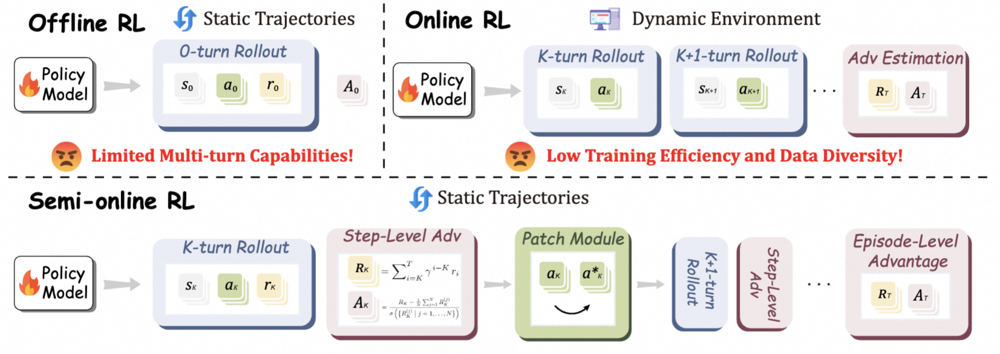
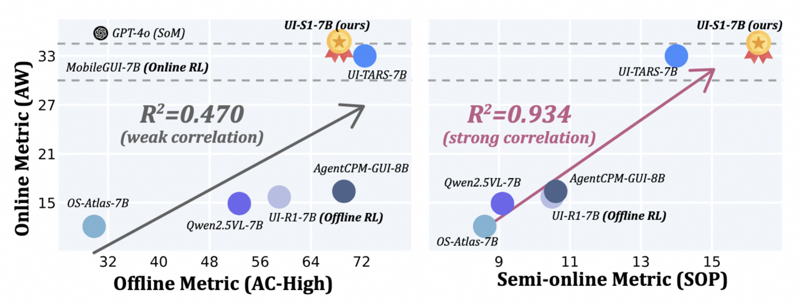
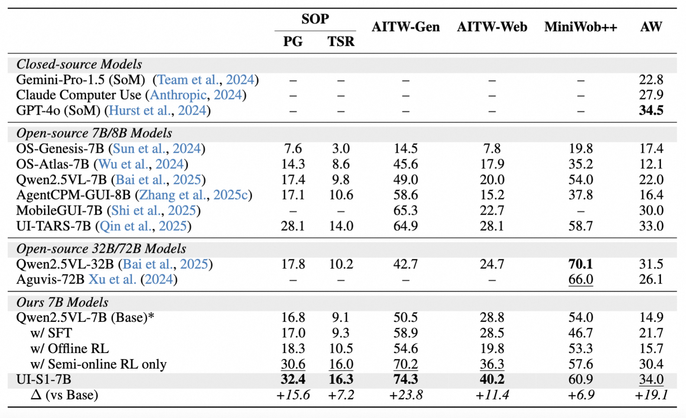

# UI-S1: Advancing GUI Automation via Semi-online Reinforcement Learning

 [[📖 Paper](https://arxiv.org/abs/2509.11543)] [[🤗 UI-S1-7B](https://huggingface.co/mPLUG/UI-S1-7B)] [[🤗 Daily Paper](https://huggingface.co/papers/2509.11543)]

## 🔥 Overview

We present **Semi-online RL**, a novel paradigm that simulates online reinforcement learning using offline trajectories, thereby enabling the efficient training of MLLM-based GUI agents with enhanced multi-turn interaction capabilities.

  

Ours <b>UI-S1-7B</b> achieves SOTA performance on both semi-online metric (SOP) and online metric (AndroidWorld) among open-source 7B models.

  

## Detailed results

  

##### Todo
- [ ] The checkpoints of UI-S1-7B will be released soon.
- [ ] The evaluation code of UI-S1-7B will be released soon.
- [ ] The training code will be released soon.

